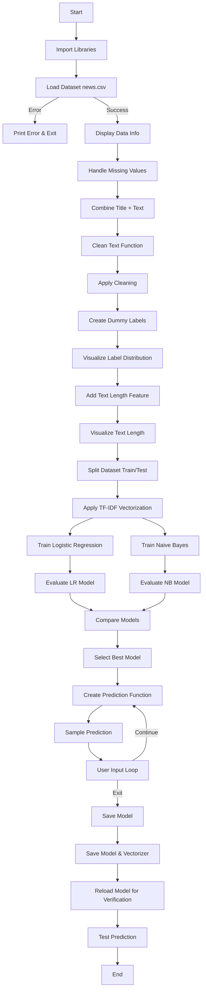

# 📰 Fake News Detection System

## →→→ Introduction

In today’s digital age, information spreads rapidly through social media and online platforms. However, not all information is reliable, and fake news has become a serious issue affecting society, politics, and public opinion.

This project presents a Python-based Fake News Detection System that uses machine learning techniques to classify news as real or fake.

- Processes textual data  
- Cleans and preprocesses content  
- Converts text using TF-IDF  
- Applies classification algorithms  

The goal is to build a simple system that helps users identify misleading or false information.

---

## Real-World Problem

Many problems caused by fake news include:

- Spread of misinformation  
- Public panic or confusion  
- Political manipulation  
- Damage to reputation  
- Misleading decisions  

**Major Issue:**
- Difficulty in verifying authenticity of news  

An automated system can help detect fake news quickly.

---

## Objectives

- Classify news as REAL or FAKE  
- Clean and preprocess text data  
- Apply machine learning models  
- Compare model performance  
- Provide real-time predictions  

---

## Concepts Used (From Coursework)

- Data preprocessing  
- String manipulation  
- Functions (modular design)  
- Conditional statements  
- Machine Learning basics  
- Data visualization  

---

## Tools & Technologies

- Python 3.x  

- Libraries:  
  - pandas  
  - numpy  
  - matplotlib  
  - re  
  - string  
  - scikit-learn  
  - pickle  

- Console-based UI  

---

## Problem Definition

- Manual verification of news is not practical  
- Large volume of online content  
- Need for automated detection  

This system solves the problem using machine learning.

---

## Requirements Analysis

### Functional Requirements

- Load dataset (`news.csv`)  
- Clean and preprocess text  
- Convert text using TF-IDF  
- Train ML models  
- Predict fake/real news  
- Accept user input  
- Save and load model  

### Non-Functional Requirements

- Easy to use  
- Fast execution  
- Accurate predictions  
- Low memory usage  

---

## Top-Down Design (Modules)

---
load_data()        → Reads dataset  
clean_text()       → Cleans text  
vectorize_text()   → TF-IDF conversion  
train_models()     → Train ML models  
evaluate_models()  → Compare models  
predict_news()     → Predict output  
main()             → Runs system

---

## Step-Wise Algorithm 

- Start
- Load dataset
- Clean text
- Combine title + content
- Apply TF-IDF
- Split dataset
- Train models
- Evaluate models
- Select best model
- Take user input
- Predict result
- Save model
- End
-Save model
-End

---

##  Flowchart 

## 📊 Project Flowchart


## ⚙️ Setup & Installation Guide

Follow these steps to set up and run the **Fake News Detection System** on your local machine.

---

### 📌 1. Prerequisites

Make sure you have the following installed:

- Python 3.x  
- pip (Python package manager)  

Check installation:

```bash
python --version
pip --version

### 📥 2. Clone the Repository

```bash
git clone https://github.com/your-username/fake-news-detection.git
cd fake-news-detection
```

---

### 🧪 3. Create Virtual Environment (Recommended)

#### ▶️ Windows
```bash
python -m venv venv
venv\Scripts\activate
```

#### ▶️ Mac/Linux
```bash
python3 -m venv venv
source venv/bin/activate
```

---

### 📦 4. Install Dependencies

Install required libraries:

```bash
pip install pandas numpy matplotlib scikit-learn
```

#### OR create a `requirements.txt` file:

```txt
pandas
numpy
matplotlib
scikit-learn
```

Then run:

```bash
pip install -r requirements.txt
```
